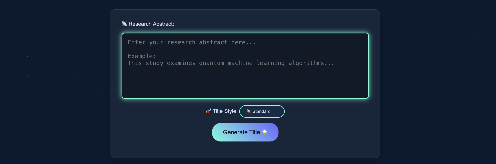

# 🔬 AITitleGenerator: Scientific Title Generation with Stylistic Control

 <!-- Replace with actual banner image -->

**Fine-tuning small language models to generate scientific titles with controlled style (concise, humorous, standard) from arXiv abstracts.**


## 📌 Abstract
This project explores small language models (<2B parameters) for generating scientific article titles with controlled stylistic properties. We:
1. Curate a dataset of 50,000 arXiv papers with titles classified as **concise**, **humorous**, or **standard**
2. Fine-tune Qwen3-1.7B using LoRA for style-guided title generation
3. Achieve state-of-the-art results on scientific title generation with stylistic control

**Key insight:** Fine-tuned small model outperform base models and can effectively generate titles matching requested, with standard titles being easiest (100% accuracy) and concise titles most challenging (25.6% accuracy).

## 🚀 Quick Start
### Prerequisites
- Conda package manager

### Installation
```bash
# Create environment
conda create --name title_generator python==3.10 -y
conda activate title_generator

# Install dependencies
pip install -r requirements.txt

# Launch web interface
python app.py
```
Visit http://localhost:5000 to access the generator interface.

### 💻 Usage
After launching `app.py`:
1. Paste scientific abstract in text box
2. Select desired style (concise/humorous/standard)
3. Click "Generate Title"
4. View model output with style classification

## 🧠 Model Architecture
**Core Model:** Qwen3-1.7B fine-tuned with LoRA  
**LoRA Configuration:**
- Rank: 16
- Alpha: 32
- Dropout: 0
- Target modules: query, key, value, output layers

**Prompt Format:**
```csharp
Generate a {concise|humorous|standard} title for a scientific paper with the following abstract:
{abstract}
Title:
```

## 📊 Dataset
50,000 arXiv papers from CS categories (cs.LG, cs.AI, stat.ML) with style annotations:

| Category  | Count  | Percentage | Avg. Title Length |
|-----------|--------|------------|-------------------|
| Concise   | 3,212  | 6.4%       | 8.3 words         |
| Humorous  | 1,035  | 2.1%       | 10.8 words        |
| Standard  | 45,753 | 91.5%      | 10.2 words        |

**Examples:**
- **Humorous:** "Bye-bye, Bluebook? Automating Legal Procedure with LLMs"
- **Concise:** "The Role of Randomness in Stability"
- **Standard:** "BoilerTAI: A Platform for Enhancing Instruction Using Generative AI"

## 📈 Results
Style classification accuracy comparison across models:

| Model                   | Overall | Concise | Humorous | Standard |
|-------------------------|---------|---------|----------|----------|
| **Qwen3-1.7B (Ours)**   | 63.0%   | 25.6%   | 63.6%    | 100.0%   |
| Qwen3-1.7B (Base)       | 60.0%   | 12.8%   | 72.7%    | 94.9%    |
| Gemma-3-1B-pt           | 40.0%   | 0.0%    | 4.5%     | 100.0%   |
| Phi-1.5                 | 41.0%   | 5.1%    | 9.1%     | 100.0%   |


## 👩‍🔧 Contributors
- Marina Frolova  
- Elizaveta Egorova
